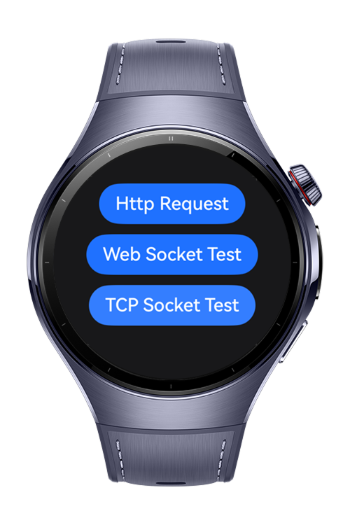
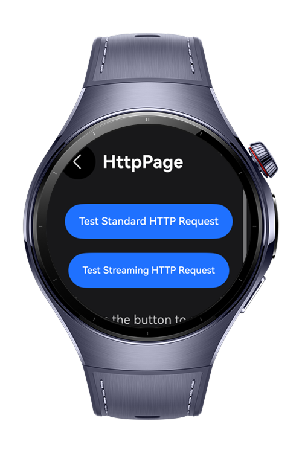
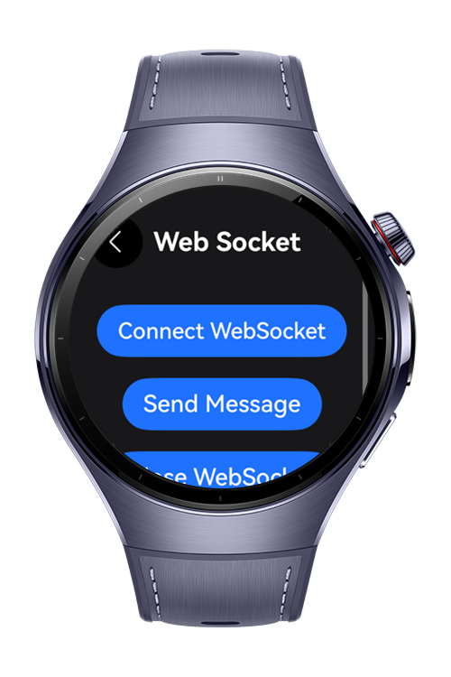
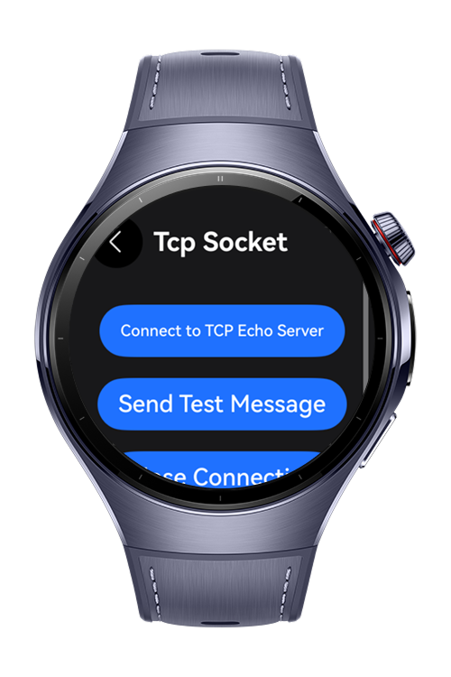

> **Note:** To access all shared projects, get information about environment setup, and view other guides, please visit [Explore-In-HMOS-Wearable Index](https://github.com/Explore-In-HMOS-Wearable/hmos-index).

# How To Use Network Kit

# Description
This project tests various HarmonyOS NetworkKit functions like Http requests, TCP and WebSocket.
It connects to public servers (like tcpbin.com, jsonplaceholder.typicode.com,echo.websocket.org) to validate data transmission, event handling, and error recovery.
The goal is to ensure stable, secure, and bug-free networking in HarmonyOS applications.

# Preview

<div style="display: flex; width:'100%'; gap:12px;">
    
    
    
    
</div>

## Use Case Scenario

- **Main Page**:
    - Users can select 3 different main functions: Http Request, Web Socket Test, TCP Socket Test
- **Http Request Test Screen**:
  - Test Standard HTTP Request – Sends a basic GET request and logs the response.
  - Test Streaming HTTP Request – Receives response data in chunks and tracks progress.
- **WebSocket Test Screen**:
  - Connect WebSocket – Establishes a connection to a WebSocket echo server.
  - Send Message – Sends a text message and logs the echoed response.
  - Close WebSocket – Closes the WebSocket connection gracefully.
- **TCP Socket Test Screen**:
  - Connect TCP Server – Connects to a public TCP echo server.
  - Send Test Message – Sends a message and logs the echoed response.
  - Close Connection – Terminates the TCP connection and unsubscribes events.

## Tech Stack

- **Languages**: ArkTS/ArkUI
- **Frameworks**: HarmonyOS SDK 5.0.0.25
- **Tools**: DevEco Studio 5.0.1.403
- **Libraries**:
    - `@kit.ArkUI`
    - `@ohos.net.http`
    - `@kit.NetworkKit`

# Directory Structure

```
entry/src/main/ets/

|---entryability
| |---EntryAbility.ets
|---entrybackupability
| |---EntryBackupAbility.ets  
|---ui
| |---pages
| | |---Index.ets
| | |---HttpPage.ets
| | |---TcpSocket.ets
| | |---WebSocket.ets
| | 
| |---utils
| | |---PermissionUtils.ets
| | 
| 

```

# Constraints and Restrictions
## Supported Devices
- Huawei Watch 5

# LICENSE

ArcList is distributed under the terms of the MIT License.
See the [LICENSE](/LICENSE) for more information.

